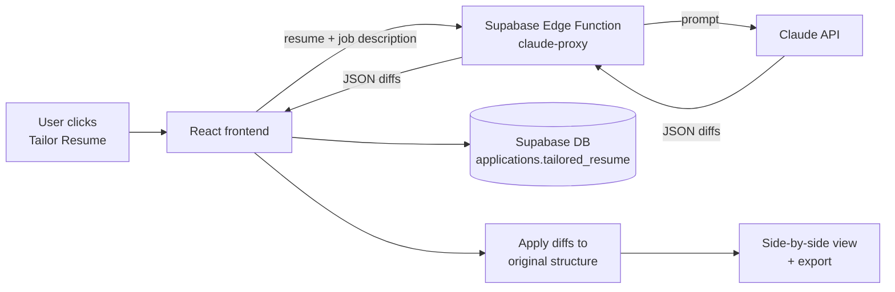

# ApplyMaster

**AI-powered resume tailoring for every job you apply to.**

ApplyMaster takes your resume and a job description, then uses the Claude API to suggest focused, bullet-level edits that match the role, without inventing experience you don't have. You review every change side by side, then export the tailored resume as a PDF.

**Live app:** [applymaster.vercel.app](https://applymaster.vercel.app)

<!-- TODO: Add 1-2 screenshots here (e.g., the side-by-side comparison view and the application page). -->

---

## Why I built it

Tailoring a resume for each application is slow, and generic AI rewriting tools tend to make things worse: they inflate claims, add skills you don't have, and turn one-line bullets into two-line paragraphs. I wanted a tool that changes only what actually improves the fit, keeps every fact accurate, and shows me exactly what changed.

## Features

- **Resume parsing:** Upload a PDF or DOCX resume. It's parsed into a structured format that keeps your original section titles and skill groups (e.g., Languages, Frameworks, Tools).
- **Bullet-level tailoring:** Claude compares your resume with the job description and returns only the bullets worth changing, not a full rewrite.
- **Side-by-side review:** Original on the left, tailored on the right, with synchronized scrolling. Only the changed words are highlighted: removed words on the left, added words on the right.
- **Job fit analysis:** Paste a job URL or description to extract the company, role, and description, and see how well you fit. Each category (skills, experience, location) lists specific gaps, marked required or preferred, and matches.
- **Cover letters and "Why this company" answers:** Generates drafts from the job description, using a cover letter template you can edit in Settings.
- **Cancelable AI actions:** Any AI request (tailoring, analysis, generation, resume parsing) can be canceled while it runs.
- **PDF export:** Embedded Lato font, named after you (e.g., `Jane_Doe_Resume.pdf`), never the company.

## How it works



1. The frontend sends the resume and job description to a Supabase Edge Function.
2. The Edge Function calls the Claude API, which returns a small JSON list of changes (section, bullet index, original text, tailored text).
3. The frontend saves only these diffs, in the `applications` table.
4. The app applies the diffs to the original resume structure to render the tailored version.

## Design decisions

**Store diffs, plus the resume they were made from.** Each application stores its diffs along with a copy of the resume version used for tailoring, so uploading a new resume never changes an earlier result. Every diff is applied only where its original text is actually found; anything that doesn't match is reported instead of overwriting a different bullet.

**Keep the API key on the server.** All Claude calls go through a Supabase Edge Function, so the API key never reaches the browser.

**Protect facts over keywords.** The tailoring prompt only allows terminology swaps that mirror the job description, forbids inventing metrics, technologies, or experience, requires each rewritten bullet to be the same length or shorter than the original, and keeps each bullet's original tense, so ongoing work like "Migrating" never becomes a finished "Migrated". Skills are never edited by the AI: the tailored resume always uses your original skill lines.

**Keep the PDF readable and close to the original.** The PDF embeds a Latin-subset Lato font (~70KB per style instead of ~650KB for the full font), so the file stays small. Body text auto-sizes between 10pt and 11pt so bullets that were one line in your original resume stay on one line.

## Tech stack

| Area | Tools |
|------|-------|
| Frontend | React, TypeScript, Vite, Tailwind CSS |
| Backend | Supabase (Auth, PostgreSQL, Edge Functions) |
| AI | Claude API (`claude-sonnet-5`) |
| Document handling | pdf.js, Mammoth (parsing) · jsPDF (PDF export) |
| Deployment | Vercel (auto-deploys from GitHub) |

## Running locally

```bash
git clone https://github.com/jiahn326/applymaster.git
cd applymaster
npm install
```

Create a `.env.local` file with your Supabase project details:

```
VITE_SUPABASE_URL=your-project-url
VITE_SUPABASE_ANON_KEY=your-anon-key
```

Link the Supabase project, set the Anthropic API key as a secret, and deploy the Edge Function:

```bash
npx supabase login
npx supabase link --project-ref your-project-ref
npx supabase secrets set ANTHROPIC_API_KEY=your-api-key
npx supabase functions deploy claude-proxy
```

Optionally, set `ALLOWED_ORIGIN` as a secret to restrict which site can call the Edge Function (it allows all origins by default).

Start the development server:

```bash
npm run dev
```

## Testing

Unit tests cover the resume logic that decides what ends up in an exported PDF: how saved tailoring changes are matched to resume bullets (changes whose original text no longer matches are reported, never applied to a different bullet), duplicated label removal, and export file names.

```bash
npm test
```

## Roadmap

- Server-side checks on AI output (length limits, no placeholder text)
- More export templates
